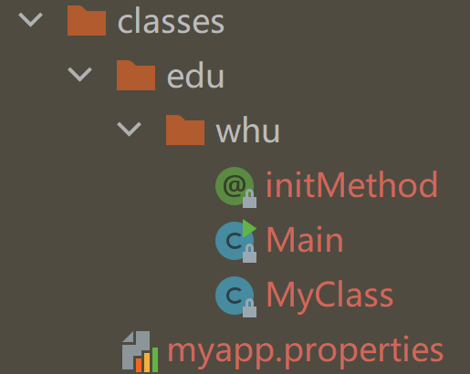

# Java_第二周

流用于读写，先写入缓冲区，再写入文件或者磁盘，所以一定记得flush，将缓冲区中的数据全部写入文件

处理二进制文件，用字节比较方便（比如图片）

文本文件可以用字符来读入（比如文本）

由操作系统控制的资源JVM无法关闭，必须手动关闭（比如文件）

### try with resource

把要使用的资源放在try中间，在try中声明的所有资源，在try结束之后都会自动调用close方法，推荐使用

jar包中的非class文件一般称为资源文件，这些文件放在class path下面，对于这些资源文件，有专门的方式读写，用getSourceAsStream(从class path根目录下面开始的相对路径)

泛型，给出了通用类型，但是使用的时候可以加上参数，从而限制范围。可以自己定义泛型类

### 反射

反射是指在程序运行的时候除了获得对象的信息，还可以获得对象的类的信息，可以通过类的信息反过来操纵对象

classloader会创建类的class对象在内存中，每个类仅创建一个对象，里面存放一些字段信息

获取字段和获取方法都有三种方式

field.get(obj)可以获取obj的field字段
method.invoke(obj)可以调用obj的method方法

### 注解annotation

springboot框架含有多个注解，引入后通过注解即可使用框架

### Maven

构建工具，编译只是构建的一部分，打包编译都是构建过程，maven可以实现更快的构建。

可以做依赖管理，用别人的文件，之前要手动copy jar文件，然后添加class path，通过声明，你要使用什么版本的什么类库，直接告诉maven，maven帮助管理，不用关心这个jar包的具体存放位置

用idea的话，自带maven，使用就很简单

新创建项目的时候没有target文件夹，但编译之后会创建，不要动maven的代码结构，否则编译会出错

使用maven会有pom.xml文件，即是maven的工程文件

maven有一个中央仓库，基本所有的类库都收录其中，指定什么版本，就会下载下来，所以使用maven需要联网

### JUnit

写Java代码都要写单元测试，可以使用junit把功能代码和测试代码完全分开

用版本5，测试后会用绿色/红色标注测试到的和未测试到的代码

fixture，使各个测试用例完全无关，使用beforeeach注解和aftereach注解，可以在每次测试之前都调用一个方法，进行清空

关于异常的测试，assertthrow后面写期望抛出的异常

### throw和throws的区别

throw

* 是写在方法内部的一句语句，表示方法内部抛出异常
* 如果异常对象不是RuntimeException，则需要在方法声明时加上该异常的抛出，即要么throws异常，要么try-catch解决，否则编译报错
* 执行到throw语句，则后面的不再执行

throws

* 方法定义上使用throws表示此方法可能抛出某种异常
* 需要方法的调用者进行异常处理

## week2作业

如果自定义注解涉及反射机制，那么一定要带上@Retention，不带的话默认在使用反射机制时找不到。

```java
@Retention(RetentionPolicy.RUNTIME)//编译保留，在class文件中存在，被JVM加载，可以使用反射机制读取和使用
@Retention(RetentionPolicy.SOURCE)//源码保留，编译忽略
@Retention(RetentionPolicy.CLASS)//编译保留，在class文件中存在，JVM忽略
```


class.getResourceAsStream(String path) ： path 不以/开头时默认是从此类所在的包下取资源，以/开头则是从ClassPath根下获取。所以在作业中需要使用/，使其从classpath的根目录即/classes/中开始取得



class.getResourceAsStream(String path) 只是通过path构造一个绝对路径，最终还是由ClassLoader获取资源。

而Class.getClassLoader.getResourceAsStream(String path) ：默认则是从ClassPath根下获取，path不能以/开头，最终是由ClassLoader获取资源。作业中如果使用Class.getClassLoader.getResourceAsStream(String path) ，那么就不加/即可

在测试的时候，发现应该抛出异常但是没抛出，因为自己在Main的代码里面就直接catch了，这种情况就应该是需要throws上去的情况，测试也是测试有没有throws上去。

由于测试类需要调用Main，而测试出正常的情况又必须需要传参，那么异常的情况也需要传一个参数，那么这样写就不能同时测出正常异常的情况，所以最后使用数组传参，这样测试类可以正常的调用Main。且数组内参数个数不对时候均会报错
