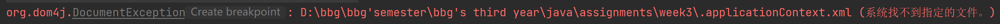
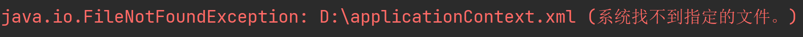

springboot是对spring又一次的封装，用起来很简单，但是原理比较难

### IOC容器

反转控制，移交控制权，把控制权交出去的过程叫做反转控制

通过bean来代表组件，可重入对象

只要是bean工厂下面的类都是IOC容器

通过propertiy注入，name统一是set后面的名字小写，value表示需要注入属性的具体值，ref则表示对另一个bean的依赖，即需要将property里面的bean注入当前bean种

把写死在类里面的东西暴露到外面去，可以在外面更改，但是又不通过代码的方式更改，而是通过依赖注入的方式去更改（xml文件，注解），这些文件可以灵活变动

本质上给我的感觉是在操作一堆bean对象，bean对象可以注入到另外一个bean对象中，并且不用通过代码控制，spring去帮助管理bean，bean可以通过注解的方式去创建，也可以通过配置文件去创建。

### spring项目

通过maven添加spring的dependency，然后创建spring config xml文件，放在resource下面，通过ref注入依赖

bean的创建方式：加载xml文件直接创建对象，是单例对象，整个程序运行过程中只有单个对象，需要注意线程安全问题

单例方式可能会有问题，对于有状态的需要存数据的bean。这个时候需要每个实例单独

### 依赖注入

属性注入：直接通过property和相应的属性名及value或者ref来注入

构造函数注入：构造函数的参数必须初始化，不初始化可能会出错，此时在xml种写constructor-arg，中间分别书写参数名和具体值

在Java file类中，.表示项目根目录

而/则表示根目录

