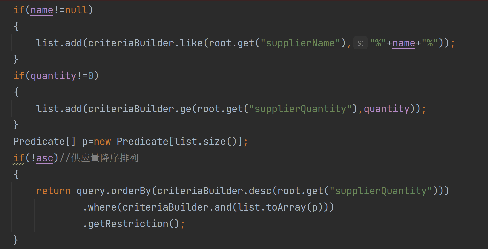

pathvariable只适用于id，需要唯一

putmapping,getmapping已经表示了增删查改，所以不需要再次映射

在数据库中，是先排序之后再进行分页

如果控制层有不同的方法，映射路径一样，调用的时候会ISE

这其中：
**Root：查询哪个表
CriteriaQuery：查询哪些字段，排序是什么
CriteriaBuilder：字段之间是什么关系，如何生成一个查询条件，每一个查询条件都是什么方式
Predicate（Expression）：单独每一条查询条件的详细描述**

@ManyToOne与@OneToMany注解，ManyToOne表明被注解的属性是一，而当前类是多

@JoinColumn注解表明一的主键在当前表中的字段的名称，相当于为外键取名字，如果没有注解的话，会自动结合表名取名字

如果出现了驼峰命名或者下划线命名，会出现前端发post的键值对的键，怎么写都不对，此时使用JsonProperty(value="前端传入的键")注解即可解决，这个注解表明前端的XX键对应的值，与后端有该注解的字段相对应，前端的A会自动填充进后端的B，此时就可以正常获取前端传入的值而不会null

而后使用get会报错，因为jsonplugin用的是java的内审机制.hibernate会给被管理的pojo加入一个hibernateLazyInitializer属性,jsonplugin会把hibernateLazyInitializer也拿出来操作,并读取里面一个不能被反射操作的属性就产生了这个异常，所以要使用@JsonIgnoreProperties(value = { "hibernateLazyInitializer"})来忽略这个字段，表示这个字段不用转化为json

服务器中的布尔属性，不给赋值的话默认是false

用正常的?来连接get的参数的时候，在后端是依靠&分割的每个字段和后端的控制层的具体变量名来进行一一匹配的

用specification的时候，root.get("XX")里面的XX一定是类里面的属性字段，而不是数据库里面的列名，如果写成列名会找不到，然后就报错

此处不能写supplier_id
